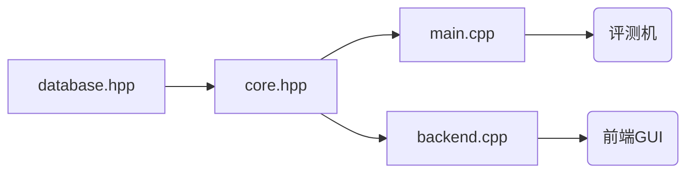

# 火车票管理系统大作业 文档

## 人员分工

暂定将将整体项目分为三个子部分，分别为：

前端&文档(人员A)：Amagi_Yukisaki

数据库(B+树)(人员B)：battlin6

后端程序(除B+树外全部算法)(人员C)：aik2mlj

## 程序架构

其中`databse.hpp​`为人员B所完成数据库核心。

`core.hpp`为人员C所完成的算法程序（注意要封装为对象，在构造、析构函数打开、关闭相应文件）。

`main.cpp`为人员C所完成的后端主程序，**其中仅包含创建`core.hpp`中类的操作及必要IO，其余所有算法均在对应类中实现！**

`backend.cpp`为人员A所做的后端程序，负责与前端程序通讯。

## 约定接口

### `database.hpp`

实现一个B+树。

**只允许访问磁盘上的单个文件！**

支持以下操作：

`Database<type1, type2>(Filename)`：创建`Key`类型为`type1`，`Value`类型为`type2`的Database类并打开名为`Filename`的数据库文件。

`insert(Key, Value)`：向B+树内插入`(Key, Value)`键值。`Key`为定义了`<`运算的可排序类，`Value`为定义了`==`运算的可比较类，`Key, Value`为定长类型（即：不同的`sizeof Key, sizeof Value`为不变常数）。**注意：不同元素的`Key`不会重复！**

`erase(Key, Value)`：删除`(Key, Value)`键值，返回值为布尔型，表示是否删除成功。**（如果找不到相应元素则返回删除失败）**

`modify(Key, New_value)`：将`(Key, Old_Value)`修改为`(Key, New_value)`，返回值为布尔型，表示是否修改成功。失败条件同上。

`query(Key)`：查询`Key`对应的`Value`。**保证此时的Key不出现重复** 返回`std::pair<bool, typeof Value>`，表示查询是否成功及查询到的`Value`值。失败条件同上。

`range(Key1, Key2)`：查询区间`[Key1, Key2]`对应的全部`Value`，返回`List<typeof Value>`，表示查询到的值。**其中`List`为自定义的列表类，支持迭代器遍历。**（为什么不使用`stl`？因为不允许。为什么能用`std::pair`？因为`std::pair`在`iostream`中有包含）**为什么不返回对应的`Key`？因为可以保证Key在Value中已被包含。**（这一点在core.hpp的实现中将会提及）

`clear()`：清空名为`Filename`的数据库文件。

`empty()`：返回bool类型，表示该数据库是否为空。

### `core.hpp`

实现`Ticket`类。

其中包含以下数据成员：

`database<type_userName, type_user> Users; // 用户的的相关信息`

`database<type_userName, int> Cur_users; // 仅判断是否已登录（value恒为0），查询详细信息还要在Users中查询 `

`database<type_trainID, type_train> Trains_base; // 列车的基本信息`

`database<type_trainID, type_train_release> Trains_released; // 已发布列车的车票信息等`

`database<type_stationName_startTime, std::pair<type_trainID, int>> Database_stations; // 用于查询某天进过某车站的列车有哪些`

`database<type_userName_orderID, type_order> Database_orders; // 各用户的订单信息`

`database<type_queue_key, type_userName_orderID> Database_queue; // 候补队列`

详细解释（不重要）：

`type_trainID`和`type_userName`是封装好的定长字符串。

`type_user`类中存储一个用户T的全部信息，`type_train`类中存储一辆列车的全部信息。

`type_train_release`需包含函数`query(st, ed)`，返回区间`(st, ed)`最大可用票数。

`type_stationName_startTime`存储某列车经过的车站和它经过这个车站的时间，**即使没有剩余座位的列车也要存储**。

`Database_stations`的value为一个std::pair，分别是该车次的runtimeID和该站在这个车次中的编号（0-base）。

`type_userName_orderID`存储用户`id`和该用户的订单`id`（对每个用户从1开始）。

`type_order`存储一个订单的所有信息。

`type_queue_key`包含车次的runtimeID和全局订单编号。

包含以下函数：

[TicketSystem-2020](https://github.com/oscardhc/TicketSystem-2020)所要求的全部函数。