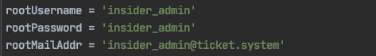
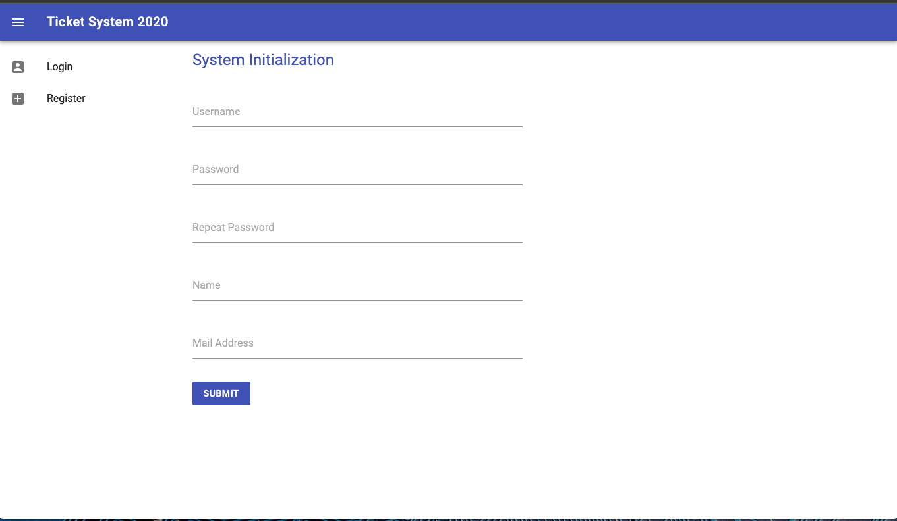
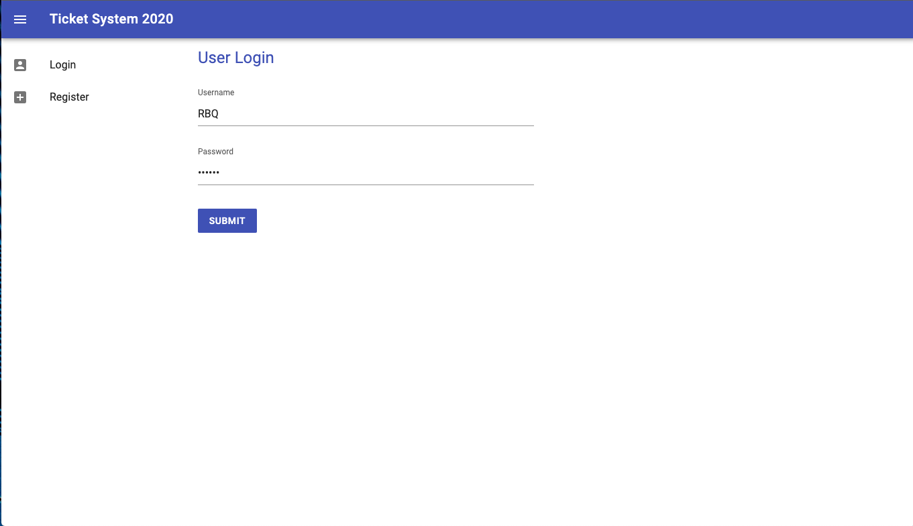
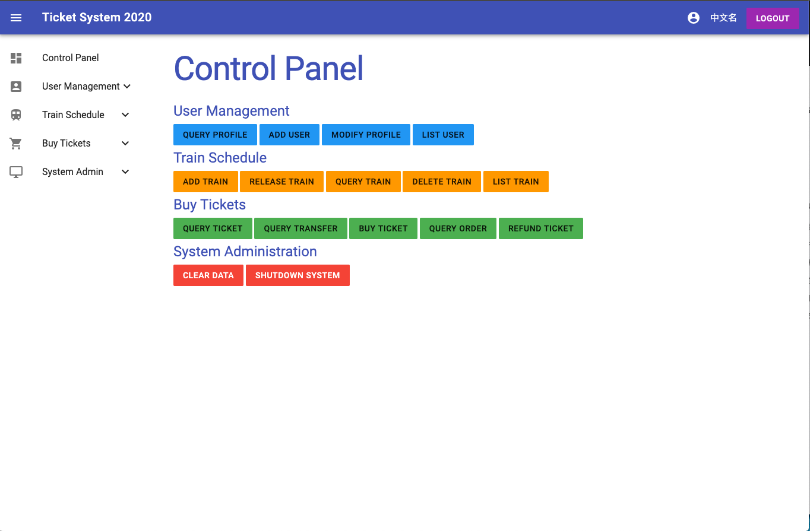
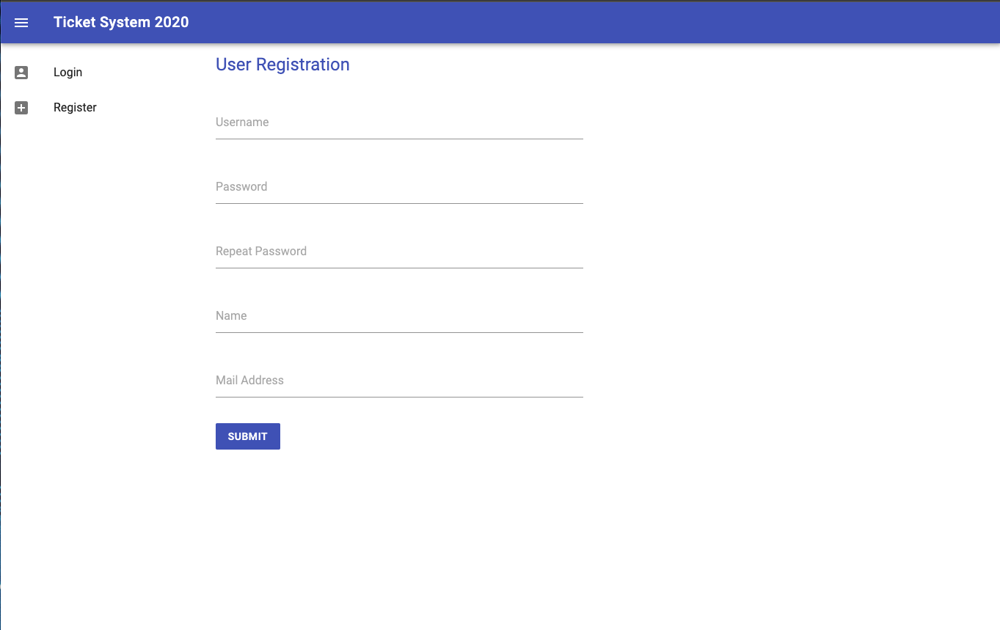
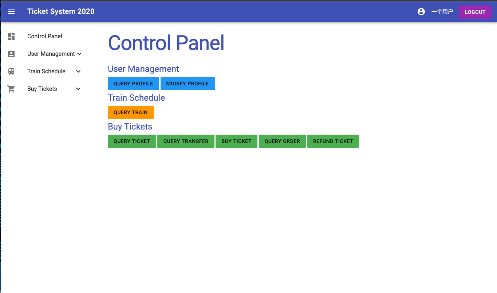

# 火车票管理系统 用户文档

## 管理员部分

### 系统初始化：

本系统基于C++和Python。

快速部署实例：

```bash
cmake CMakeList.txt
make
python3 -m pip install flask
python3 ./app.py
```

`app.py`中`4-6`行为系统内置管理员信息：



请于初始化实例前进行修改，需满足数据格式约定*。

注：重置实例方法为：

```bash
sh ./clean.sh
```

之后访问web端界面，进行管理员账户(权限为9，内置管理员为19)创建：



创建后转到登录界面，登录管理员账户：



即可进入控制面板：



主页左侧边栏显示快速索引，右侧显示可用操作。

### 管理员操作

#### Query Profile

查询用户信息。

输入用户Username，获取用户全部信息（除密码）

当前用户权限需高于被查询用户或当前用户与被查询用户相同。

#### Add User

添加新用户。

**注意新用户权限必须低于当前登录用户**

#### Modify Profile

修改用户信息

同样需要满足权限、输入内容要求，不修改内容可不填。

#### Add Train

添加列车，需输入列车全部信息。多项信息用`|`分割。

#### Release Train

发行列车，仅需输入`Train ID`。

发行后的列车可被购票。

#### Delete Train

删除列车，不能删除已被发行的列车。

#### Clear Data

慎用！

清除系统全部数据。

#### Shutdown System

慎用！

关闭系统，需要控制台重启`python3`才能进行重启。

#### 其余操作：

同用户部分：用户操作


## 用户部分

### 注册账户：

本系统提供注册功能（暂未设验证码，请勿滥用注册）

首页点击`Register`进行注册。



之后登录进入用户界面：



### 用户操作：

#### Query Profile

只能查询自己的信息

（点击头像框可也实现相同功能～）

#### Modify Profile

修改用户信息。

只能修改自己的用户信息。

#### Query Train

查询指定车次指定日期的全部信息。

#### Query Ticket

查询某天开行，两站间的直达票。

可选择递增排序参数：时间、价格。

（可进行快速购票）

#### Query Transfer

查询某天开行，两站间的单次换乘票。

可选择递增排序参数：时间、价格。

只会输出一组最优解。

（可进行快速购票）

#### Buy Ticket

购票，需输入车次、日期、购买区间、购票数目、是否允许候补。

#### Query Order

查询当前用户全部订单。

（可进行快速退票）

#### Refund Ticket

输入订单数`n`进行退票。

对倒数第`n`次订单进行退票，`1-base`。

## 附：数据格式约定

本系统具输入格式检查功能，输入数据格式需满足以下约定：

（以下数据来自[oscardhc/TicketSystem-2020](https://github.com/oscardhc/TicketSystem-2020/readme.md))

#### 用户相关

一个用户有以下数据：

- `username`：用户的唯一标识符，由字母开头，字母、数字和下划线组成的字符串，长度不超过20。
- `password`：由字母、数字和下划线组成的字符串，长度不低于6，不超过30。
- `name`：由二至五个汉字组成的字符串。
- `mailAddr`：同一般邮箱地址格式，且仅含数字、大小写字母，`@`和`.`，长度不超过30。（无需检验邮箱格式的合法性）
- `privilege`：所处用户组优先级，为一个0~10的整数。

#### 车次相关

一个车次有以下属性：

- `trainID`：车次的唯一标识符，由字母开头，字母、数字和下划线组成的字符串，长度不超过20。

- `stationNum`：车次经过的车站数量，为大于1且不超过100的整数。

- `stations`：车次经过的所有车站名，共`stationNum`项，站名由汉字组成，不超过10个汉字。

  格式为：`station_1 station_2 station_3 ... station_stationNum`

- `seatNum`：该车次的座位数，为不超过100000的整数。

- `prices`：每两站之间的票价，共`(stationNum - 1)`项，第`i`项表示`station_i`到`station_(i+1)`的票价，是一个不超过100000的整数。

  格式为：`price_1 price_2 price_3 ... price_(stationNum - 1)`

- `startTime`：列车每日的发车时间，时间格式为`hr:mi`。如：`23:51`。

- `travelTimes`：每两站之间行车所用的时间（单位为分钟），共`(stationNum - 1)`项，每一项是一个不超过10000的整数。

- `stopoverTimes`：除始发站和终点站之外，列车在每一站停留的时间（单位为分钟），共`(stationNum - 2)`项，每一项是一个不超过10000的整数。

- `saleDate`：车次的售卖时间区间（闭区间），在时间区间内，每天都有相同的此车次。共2项，每一项均为2020年6月至8月的某一天，日期格式为`mm-dd`。如：`06-07`。

- `type`：列车类型，为一个大写字母。